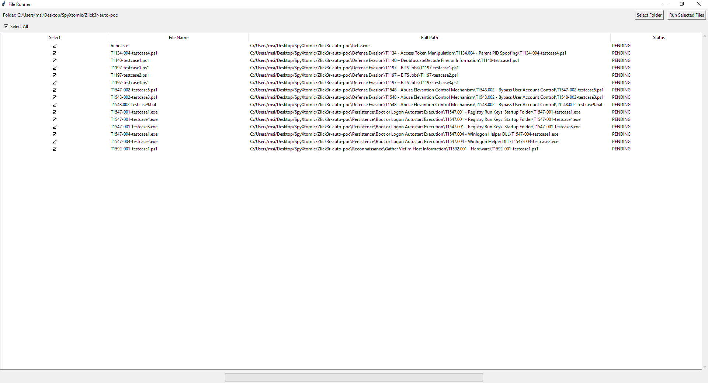

# SpyXtomic 
- Project này cho Redteam thực hiện kiểm thử EDR/AV cho hệ thống
# Cách dùng
- Chạy lệnh `pip install -m requirements.txt` để cài đặt các thư viện cần thiết
- Thêm file Dll.dll vào thư mục C:/Windows/Temp
- Chạy file run.py để hiển thị giao diện tool

- Nếu file chạy thành công thì sẽ ghi logs vào C:/Windows/Temp/SpyGenLog.txt với format 
[Tatic] - [testcase] - [Fail/Susscess]
- ví dụ: 1003.001 - testcase 1 - Fail
# Chú ý
- Các tatic lưu ở định dạng file khác exe đều có thể tấn công được và không bị detect, mình chưa chuyển thành dạng exe nên có thể sẽ phải đợi chuyển sau
- Đối với các tatic bypass UAC, sẽ hiển thị cmd với full quyền, chưa lưu vào log nên sẽ cần test tay